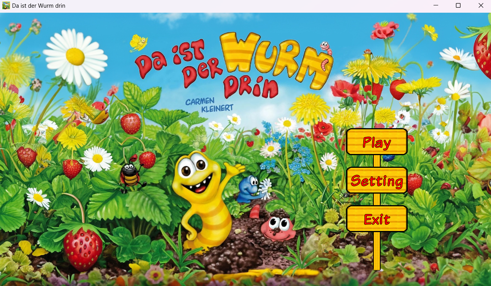
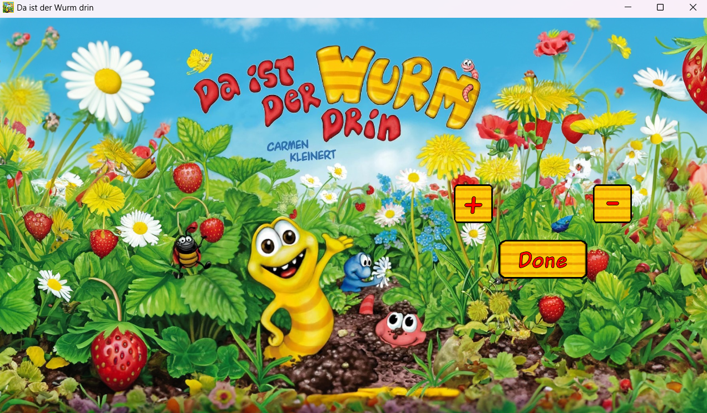
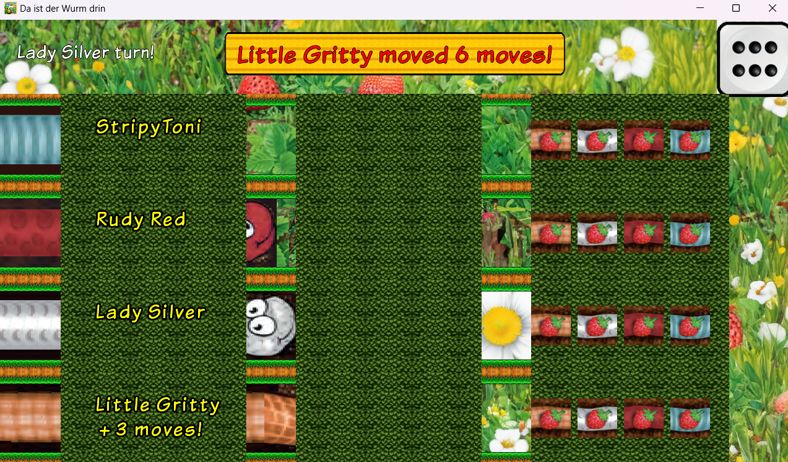
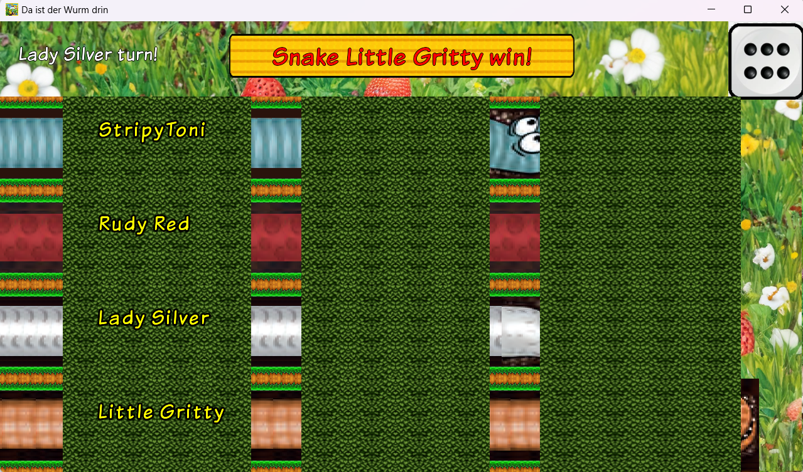
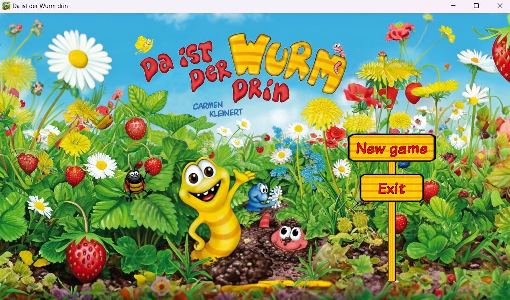

# Da-ist-der-Wurm-drin

An Java game project in Java OOP Programming modules (FRA-UAS)

---

## Table of Contents
1. [Prerequisites](#prerequisites)
2. [Installation](#installation)
3. [Running the Game](#running-the-game)
4. [Download Executable](#download-executable)
5. [UI/UX](#uiux)
6. [Project Report](#project-report)
7. [Poster](#poster)
8. [Credits](#credits)

---

## Prerequisites

Ensure you have the following installed on your system:
- **Java Development Kit (JDK)** (version 8 or higher)
- **Git** (optional, for cloning the repository)

### Installing JDK

1. Download the latest JDK from the official [Oracle website](https://www.oracle.com/java/technologies/javase-downloads.html) or [OpenJDK](https://openjdk.org/).
2. Follow the installation instructions for your operating system.
3. Verify the installation by running the following command in your terminal or command prompt:
   ```bash
   java -version
   ```

---

## Installation

1. Clone the repository:
   ```bash
   git clone <repository-url>
   ```
   Or download the repository as a ZIP file and extract it.

2. Navigate to the project directory:
   ```bash
   cd <project-directory>
   ```

3. Import the project into your favorite IDE (e.g., IntelliJ IDEA, Eclipse, or VS Code).
4. Ensure the `libGDX` dependencies are properly configured. You can do this by syncing the Gradle project.

---

## Running the Game

### From the IDE
1. Open the main game class (e.g., `com.mygdx.game.MyGdxGame`).
2. Run the main method.

### From Command Line
1. Build the project using Gradle:
   ```bash
   ./gradlew desktop:run
   ```

---

## Download Executable

Download the prebuilt executable to run the game directly on your system:
- [Game Executable](link-to-exe)

---

## UI/UX

### Menu State


### Setting State


### Betting State


### Winning State


### End State


---

## Project Report

The full project report is available here:
- [LaTeX report(Preview PDF)](UI/Game%20Report.pdf)

---

## Poster

View the game poster here:
- [Game Poster (Preview PDF)](UI/Game%20Poster.pdf)

---

## Credits

- **Developer:** Your Name
- **Framework:** LibGDX
- **Additional Libraries:** List any additional libraries used

---

Enjoy the game! Feel free to report issues or contribute to the project.
